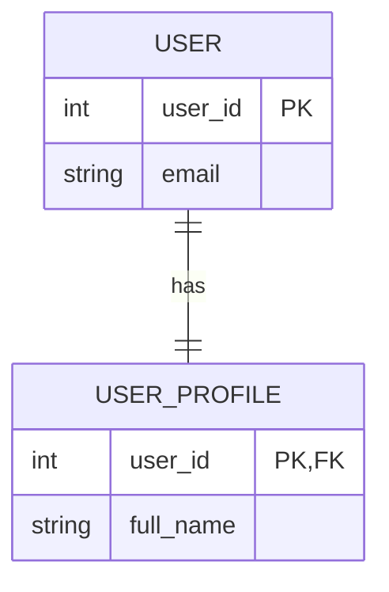

# mermaid-efcore

Transform Mermaid ER diagrams into enterprise-ready Entity Framework Core models with a single click.

## Overview

**mermaid-efcore** is a code generation tool that bridges the gap between database design and C# implementation. Define your database schema using Mermaid ER diagram syntax, and generate production-quality Entity Framework Core entity classes and DbContext configuration automatically.

### Key Features

- 🎨 **Visual Database Design**: Use familiar Mermaid ER diagram syntax
- ⚡ **One-Click Generation**: Instantly generate C# entities and DbContext
- 🏢 **Enterprise-Ready Output**: 
  - Owned entities (one-to-one relationships)
  - Nullable foreign keys
  - Composite keys
  - Join tables (many-to-many)
  - Keyless entities
  - Proper pluralization
- 🔧 **Extensible Architecture**: Language-agnostic schema model supports TypeScript, Python, Java generators (future)
- 🚀 **Zero Configuration**: Works out-of-the-box with sensible defaults
- 📋 **Type Safety**: Generated C# uses `required` modifiers and proper nullable annotations

## Architecture

```
mermaid-efcore/
├── mermaid-efcore-server/        # Blazor Server UI + API
│   ├── Services/
│   │   ├── MermaidParser.cs       # Parses Mermaid ER syntax → Schema
│   │   └── CSharpGenerator.cs     # Schema → C# entities + DbContext
│   ├── Models/
│   │   └── Schema.cs              # Language-agnostic data model
│   ├── Components/
│   │   └── Pages/
│   │       └── Generator.razor    # Interactive web UI
│   └── Program.cs
├── EfCoreTestApp/                # Test/demo console app
└── mermaid.mmd                   # Example Mermaid ER diagram
```

### Schema Model (Language-Agnostic)

The `Schema` model represents database structure independently of output language:
- **Entity**: Name, attributes, relationships
- **EntityAttribute**: Name, data type, PK/FK flags
- **Relationship**: FromEntity → ToEntity with cardinality

This allows adding TypeScript, Python, Java generators using the same parsed schema.

## Getting Started

### Prerequisites

- .NET 10.0 or later
- Blazor runtime support (modern browser)

### Build

```bash
cd mermaid-efcore-server
dotnet build
```

### Run

```bash
cd mermaid-efcore-server
dotnet run --no-hot-reload
```

The Blazor Server will start at `http://localhost:5210`. Open in your browser to access the interactive generator.

### Usage

1. **Write Mermaid ER Diagram**: Paste your diagram in the left panel
   ```
   erDiagram
       USER {
           int user_id PK
           string email UK
           datetime created_at
       }
       
       POST {
           int post_id PK
           int user_id FK
           string title
       }
       
       USER ||--o{ POST : "writes"
   ```

2. **Generate Code**: Click "Generate"
3. **View Output**: Switch between "Entities" and "DbContext" tabs
4. **Copy & Use**: Click "Copy" to grab the code

## Mermaid ER Syntax Support

### Entity Definition

```mermaid
ENTITY_NAME {
    type column_name [PK] [FK] [UK]
    ...
}
```

**Flags**:
- `PK` - Primary Key
- `FK` - Foreign Key
- `UK` - Unique Key (parsed but not yet enforced)

**Supported Types**: `int`, `string`, `datetime`, `bool`, `decimal`, `float`, `uuid`, `json`, etc.

### Relationships

```mermaid
ENTITY1 ||--o{ ENTITY2 : "label"
```

**Cardinality**:
- `||` - Exactly one (1:1 or many:1)
- `o|` - Zero or one (optional)
- `o{` - Zero or many (optional many)
- `{` - One or many (required many)

**Generated Output**:
- One-to-many: `ICollection<T>` navigation
- One-to-one: `T?` navigation
- Composite keys: `.HasKey(e => new { ... })`
- Owned entities: `.OwnsOne(e => e.Property)`

## Generated Code Example

**Input Mermaid**:


**Output (models.cs)**:
```csharp
public class User
{
    public int UserId { get; set; }
    public required string Email { get; set; }
    
    public UserProfile? UserProfile { get; set; }
}

public class UserProfile
{
    public int UserId { get; set; }
    public required string FullName { get; set; }
}
```

**Output (AppDbContext.cs)**:
```csharp
public class AppDbContext : DbContext
{
    public AppDbContext(DbContextOptions<AppDbContext> options) : base(options) { }

    public DbSet<User> Users { get; set; } = default!;
    public DbSet<UserProfile> UserProfiles { get; set; } = default!;

    protected override void OnModelCreating(ModelBuilder modelBuilder)
    {
        modelBuilder.Entity<User>()
            .OwnsOne(e => e.UserProfile);
    }
}
```

## Advanced Features

### Owned Entities

Detected automatically when a 1:1 relationship exists where the dependent entity's PK equals its FK:

```mermaid
USER ||--|| USER_PROFILE : "has_profile"  % USER_PROFILE.user_id is both PK and FK
```

Generated as `.OwnsOne()` in DbContext.

### Many-to-Many (Join Tables)

Join tables (composite PKs where all keys are FKs) are detected and NOT included in DbSets:

```mermaid
POST_TAG {
    int post_id PK,FK
    int tag_id PK,FK
}

POST ||--o{ POST_TAG : ""
TAG ||--o{ POST_TAG : ""
```

### Composite Keys

Automatically detected and configured:

```mermaid
ORDER_ITEM {
    int order_id PK,FK
    int line_number PK
    string sku
}

ORDER ||--o{ ORDER_ITEM : ""
```

Generates: `.HasKey(e => new { e.OrderId, e.LineNumber })`

### Duplicate Relationships

Multiple relationships between the same two entities are deduplicated (requires distinct FKs to represent multiple paths):

```mermaid
POST {
    int created_by_user_id FK
    int updated_by_user_id FK
}

USER ||--o{ POST : "created"
USER ||--o{ POST : "updated"
```

Would require explicit FK column naming in Mermaid to work correctly.

## Extensibility

The `Schema` model is language-agnostic. To add a new language generator:

1. Create `TypeScriptGenerator.cs` or `PythonGenerator.cs` in `Services/`
2. Implement the same `Schema` input
3. Output language-specific code

Example:
```csharp
public class TypeScriptGenerator
{
    public string GenerateInterfaces(Schema schema) { ... }
    public string GenerateModels(Schema schema) { ... }
}
```

## Testing

Run the test app to verify generated code compiles and works:

```bash
cd EfCoreTestApp
dotnet build
dotnet run
```

Creates an SQLite database (`efcore-test.db`) using the generated models.

## Known Limitations

- Reserved C# keywords as entity/attribute names are not yet escaped
- Fluent API constraints (e.g., `HasMaxLength`) not yet generated
- No migration generation (models only)
- Mermaid validation errors not user-friendly
- No support for Mermaid ER diagram visualization in extension (yet)

## Roadmap

- [ ] VS Code extension
- [ ] TypeScript/Node.js generator
- [ ] Python generator
- [ ] Java Spring Boot generator
- [ ] EF Core migration generation
- [ ] Constraint/validation attributes (`[MaxLength]`, etc.)
- [ ] Hosted cloud API + team features
- [ ] Swagger/OpenAPI export

## Contributing

This is an open-source project. Contributions welcome for:
- Additional language generators
- Constraint detection and generation
- Better error messages
- Performance improvements

## License

MIT - Use for commercial and private projects.

## Support

- GitHub Issues: Report bugs
- Discussions: Feature requests and feedback

---

**Made with ❤️ for .NET developers who want to design databases visually.**
